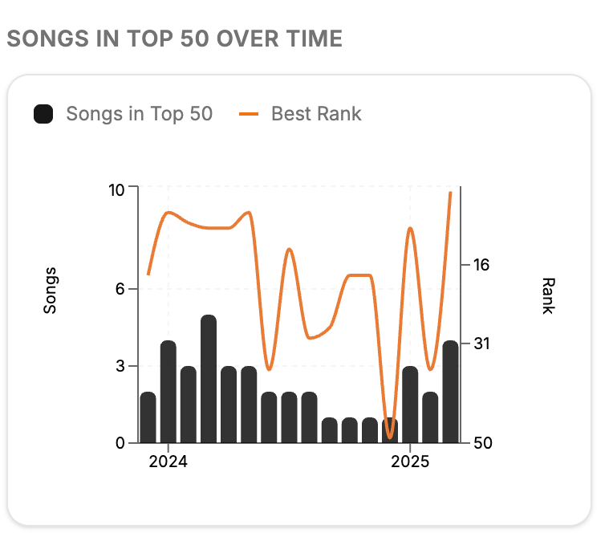
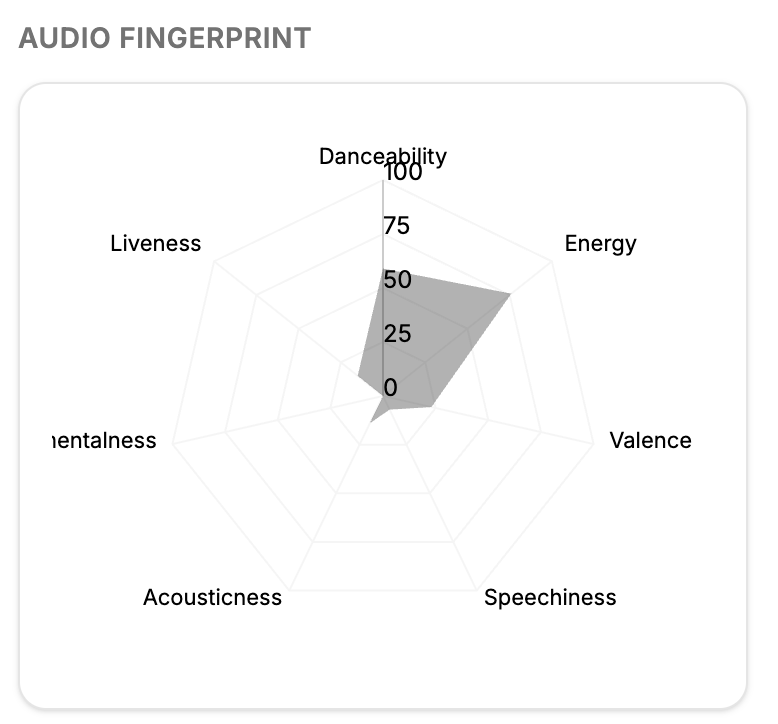

# Spotify Collaboration Network  
### Final Design Presentation  
**Samuel Wittlinger (524955)**  
**Matej Kanuch (524948)**

---

## Project Topic

**Goal:**  
Allow exploration of artists, their performance and collaborations based on Spotify chart data.

**Focus:**  
- Show **who works with whom**  
- Reveal **artist groups and connections**  
- Provide detailed **artist insights** via interactive panel

---

## Dataset
Data from top 50 charts on spotify around the world.

Contains rows with:
- song
- artists
- rank
- song attributes (tempo, key, mode)

---

## Design Choices

**Main View:**
- A **network graph** of artists and their collaborators  
- Nodes = Artists  
- Links = Collaboration edges  
- Interactive panning, zooming, and selection

---

  

---

## Design Choices

**Side Panel:**
- Appears when artist is selected  
- Displays:
  - Artist name, photo, and genre  
  - Popularity timeline (songs & chart positions)  
  - Audio fingerprint  
  - Key tracks (best songs of last 3 years)

---

---

---

## Interactivity

### Graph
- Drag, zoom, and pan freely
- Click artist → open detail panel  
- Click again → deselect

### Search
- Autocomplete search bar for artist names  
- Selecting artist recenters graph  
- Artist detail loads instantly

---

## Implementation Plan

**Frontend Stack:**
- **React + Next.js (TypeScript)**  
- **D3.js** → for dynamic network visualization  
- **Recharts** → for smaller internal charts

---

## Implementation Plan

**Data Preprocessing (Python + pandas):**
1. Filter Spotify CSV to Czech & Slovak charts  
2. Aggregate by artist  
3. Generate JSONs:
   - `network.json` (nodes + links)  
   - `artistStats.json` (aggregated metrics)
4. Fetch missing artist images via **Spotify API**

---

# Thank you!
### Questions?
